# Neovim Configuration Migration Guide

## Overview

This document outlines the differences between the legacy configuration (located at `../nvim.bak`) and the new AstroNvim v5 configuration (`nvim`), providing migration steps for key customizations.

## ESSENTIAL MIGRATIONS (USER REQUIREMENTS)

Based on user interview, these are the **required** features to migrate:

1. **Shadowenv integration** for Shopify development - Must work seamlessly
2. **Language packs** for daily work languages:
   - Ruby (primary language)
   - Rust (actively learning)
   - C/C++ (occasional use)
   - Lua, YAML, JSON, TOML (config files)
3. **Key mappings** that are muscle memory:
   - `<C-h/j/k/l>` for split navigation
   - `<D-s>` for save (macOS Command key)
   - `<leader>fs` for file search
   - Test runner mappings (`<leader>t{n,f,l,c,s,v}`)
4. **AI Integration** (Updated requirement):
   - GitHub Copilot with tight LSP integration
   - Seamless completion experience
   - No other AI assistants (Avante, Aider, etc.)
5. **Test runner integration** - vim-test with custom runner

## Key Recommendations for AstroNvim v5

Before migrating, understand these important changes:

1. **Embrace v5's new tools**: Use Snacks.nvim (not Telescope) and Blink.cmp (not nvim-cmp)
2. **Leverage Community Packs**: They handle most configuration automatically
3. **Minimize customization**: v5 works best with convention over configuration
4. **Remove old workarounds**: Drop complex patterns like lspMux that may no longer be needed

## Migration Steps

### Step 1: Enable Core Configuration Files

Remove the guard line `if true then return {} end` from these files:

```bash
# Remove the guard line from:
cd ~/.config/nvim
vim lua/plugins/astrocore.lua    # Core settings & mappings
vim lua/plugins/astrolsp.lua     # LSP configurations
vim lua/plugins/astroui.lua      # UI & theme settings
vim lua/community.lua            # Community packs
# Leave these disabled for now:
# lua/plugins/treesitter.lua    # Handled by language packs
# lua/plugins/mason.lua         # Handled by language packs
```

### Step 2: Configure Community Packs with AI Integration

Edit `lua/community.lua` to use language packs AND Copilot integration:

```lua
return {
  "AstroNvim/astrocommunity",
  -- Language packs (these handle LSP, treesitter, mason tools automatically)
  { import = "astrocommunity.pack.ruby" },
  { import = "astrocommunity.pack.rust" },
  { import = "astrocommunity.pack.cpp" },
  { import = "astrocommunity.pack.lua" },
  { import = "astrocommunity.pack.yaml" },
  { import = "astrocommunity.pack.json" },
  { import = "astrocommunity.pack.toml" },
  
  -- AI Integration Recipe - CRITICAL for proper Tab handling with Blink.cmp
  { import = "astrocommunity.recipes.ai" },
  
  -- Copilot - Provides tight LSP integration
  { import = "astrocommunity.completion.copilot-lua" },
  
  -- Theme
  { import = "astrocommunity.colorscheme.catppuccin" },
  
  -- Useful motion plugins
  { import = "astrocommunity.motion.nvim-surround" },
  { import = "astrocommunity.motion.mini-move" },
}
```

**Why include AI recipe?** The `astrocommunity.recipes.ai` sets up proper Tab key handling that allows Copilot suggestions and LSP completions to coexist without conflicts. Without it, you'd have to choose between accepting Copilot suggestions OR navigating completions with Tab.

### Step 3: Minimal Core Configuration

Edit `lua/plugins/astrocore.lua` with only essential overrides:

```lua
return {
  "AstroNvim/astrocore",
  opts = {
    features = {
      large_buf = { size = 1024 * 256, lines = 10000 },
      autopairs = true,
      cmp = true,
      diagnostics_mode = 3,
      highlighturl = true,
      notifications = true,
    },
    options = {
      opt = {
        relativenumber = true,
        number = true,
        wrap = false,
      },
    },
    mappings = {
      n = {
        -- Use Snacks.nvim picker (v5's replacement for Telescope)
        ["<leader>fs"] = { "<cmd>Snacks.picker.files()<cr>", desc = "Find files" },
        ["<D-s>"] = { "<cmd>w<cr>", desc = "Save file" },
      },
      i = { ["<D-s>"] = { "<cmd>w<cr>", desc = "Save file" } },
      v = { ["<D-s>"] = { "<cmd>w<cr>", desc = "Save file" } },
    },
  },
}
```

### Step 4: Configure Copilot for Optimal Integration

Create `lua/plugins/copilot.lua` to fine-tune Copilot behavior:

```lua
return {
  "zbirenbaum/copilot.lua",
  opts = {
    suggestion = {
      enabled = true,
      auto_trigger = true,
      debounce = 75,
      keymap = {
        accept = false, -- Handled by AI recipe's Tab integration
        accept_word = "<M-Right>",
        accept_line = "<M-Down>",
        next = "<M-]>",
        prev = "<M-[>",
        dismiss = "<C-]>",
      },
    },
    filetypes = {
      yaml = true,
      markdown = true,
      help = false,
      gitcommit = true,
      gitrebase = false,
      ["."] = false,
    },
  },
}
```

**Why copilot.lua?** 
- **Native Neovim**: Built specifically for Neovim, not a port from VSCode
- **Performance**: Async operations don't block your typing
- **LSP-aware**: Copilot suggestions complement rather than compete with LSP completions
- **AstroNvim integration**: First-class support through AstroCommunity

### Step 5: Clean Shadowenv Integration

Create `lua/plugins/shadowenv.lua` for automatic shadowenv wrapping:

```lua
return {
  {
    "Shopify/shadowenv.vim",
    lazy = false,
    enabled = vim.fn.executable("shadowenv") == 1,
  },
  {
    "AstroNvim/astrolsp",
    optional = true,
    opts = {
      config = {
        -- Only override the command if shadowenv exists
        ruby_lsp = vim.fn.executable("shadowenv") == 1 and {
          cmd = { "shadowenv", "exec", "--", "ruby-lsp" },
        } or {},
        rust_analyzer = vim.fn.executable("shadowenv") == 1 and {
          cmd = { "shadowenv", "exec", "--", "rust-analyzer" },
        } or {},
        clangd = vim.fn.executable("shadowenv") == 1 and {
          cmd = { "shadowenv", "exec", "--", "clangd", "--query-driver=/opt/homebrew/opt/llvm/bin/*" },
        } or {},
      },
    },
  },
}
```

### Step 6: Smart Splits with Complete Configuration

Create `lua/plugins/smart-splits.lua`:

```lua
return {
  "mrjones2014/smart-splits.nvim",
  lazy = false,
  keys = {
    -- Navigation (works in normal and terminal modes)
    { "<C-h>", function() require("smart-splits").move_cursor_left() end, desc = "Move to left split", mode = { "n", "t" } },
    { "<C-j>", function() require("smart-splits").move_cursor_down() end, desc = "Move to lower split", mode = { "n", "t" } },
    { "<C-k>", function() require("smart-splits").move_cursor_up() end, desc = "Move to upper split", mode = { "n", "t" } },
    { "<C-l>", function() require("smart-splits").move_cursor_right() end, desc = "Move to right split", mode = { "n", "t" } },
    
    -- Resizing
    { "<M-h>", function() require("smart-splits").resize_left() end, desc = "Resize split left" },
    { "<M-j>", function() require("smart-splits").resize_down() end, desc = "Resize split down" },
    { "<M-k>", function() require("smart-splits").resize_up() end, desc = "Resize split up" },
    { "<M-l>", function() require("smart-splits").resize_right() end, desc = "Resize split right" },
  },
  opts = {
    ignored_filetypes = { "nofile", "quickfix", "prompt" },
    ignored_buftypes = { "nofile" },
  },
}
```

### Step 7: Simplified vim-test

Create `lua/plugins/vim-test.lua` (without custom runner unless essential):

```lua
return {
  "vim-test/vim-test",
  cmd = { "TestNearest", "TestFile", "TestLast", "TestClass", "TestSuite", "TestVisit" },
  keys = {
    { "<leader>t", desc = "󰙨 Testing" },
    { "<leader>tn", "<cmd>TestNearest<CR>", desc = "Test Nearest" },
    { "<leader>tf", "<cmd>TestFile<CR>", desc = "Test File" },
    { "<leader>tl", "<cmd>TestLast<CR>", desc = "Test Last" },
    { "<leader>tc", "<cmd>TestClass<CR>", desc = "Test Class" },
    { "<leader>ts", "<cmd>TestSuite<CR>", desc = "Test Suite" },
    { "<leader>tv", "<cmd>TestVisit<CR>", desc = "Test Visit" },
  },
  init = function()
    vim.g["test#strategy"] = "neovim"
    vim.g["test#neovim#term_position"] = "botright 15"
    vim.g["test#neovim#start_normal"] = 1
    
    -- Only add custom runner if you REALLY need nvim-test-runner
    -- vim.cmd [[
    --   function! DevTestTransform(cmd) abort
    --     return 'nvim-test-runner '.shellescape(a:cmd)
    --   endfunction
    --   let g:test#custom_transformations = {'dev': function('DevTestTransform')}
    --   let g:test#transformation = 'dev'
    -- ]]
  end,
}
```

### Step 8: Set Theme

Edit `lua/plugins/astroui.lua`:

```lua
return {
  "AstroNvim/astroui",
  opts = {
    colorscheme = "catppuccin-frappe",
  },
}
```

### Step 9: Format on Save Configuration

Edit `lua/plugins/astrolsp.lua` to maintain your format preferences:

```lua
return {
  "AstroNvim/astrolsp",
  opts = {
    formatting = {
      format_on_save = {
        enabled = true,
        ignore_filetypes = { "c", "cpp" }, -- Your preference
      },
    },
  },
}
```

## Understanding the Copilot + LSP Integration

With this setup, you get a seamless experience:

1. **Tab Behavior**:
   - If Copilot has a suggestion → Accept it
   - Else if in a snippet → Jump to next position
   - Else → Normal Tab behavior

2. **Completion Flow**:
   - Type code → LSP completions appear in Blink.cmp menu
   - Copilot suggestions appear as ghost text
   - Both work together without conflicts

3. **Navigation**:
   - `<C-n>/<C-p>` - Navigate LSP completion menu
   - `<M-]>/<M-[>` - Cycle through Copilot suggestions
   - `Tab` - Accept whatever is most relevant

## What NOT to Migrate

Based on v5 best practices, do NOT migrate:

1. **Aider integration** - You have Copilot now
2. **Avante.nvim** - Not needed with Copilot
3. **Complex lspMux workarounds** - Modern rust-analyzer shouldn't need this
4. **Manual treesitter/mason lists** - Language packs handle these
5. **Custom nvim-test-runner transform** - Use default strategies unless essential

## Post-Migration Testing

1. **Verify basics work**:
   ```bash
   cd ~/.config/nvim
   nvim
   :Lazy sync
   :checkhealth
   :Copilot auth  # Authenticate Copilot
   ```

2. **Test shadowenv integration**:
   ```bash
   cd /path/to/shopify/project
   nvim some_file.rb
   :LspInfo  # Should show: ruby-lsp running with shadowenv
   ```

3. **Test key features**:
   - [ ] `<leader>fs` opens file picker (Snacks.nvim)
   - [ ] `<C-h/j/k/l>` navigates splits
   - [ ] `<D-s>` saves file
   - [ ] `K` shows hover docs
   - [ ] Completion works (Blink.cmp)
   - [ ] Copilot suggestions appear as ghost text
   - [ ] `Tab` accepts Copilot suggestions
   - [ ] `<leader>tn` runs nearest test

4. **Check performance**:
   ```vim
   :Lazy profile
   ```
   Startup should be under 100ms

## Troubleshooting

### Copilot not working
- Run `:Copilot auth` to authenticate
- Check `:Copilot status` for connection issues
- Ensure you're in a supported filetype

### Tab key confusion
- The AI recipe handles Tab intelligently
- If issues persist, check `:verbose map <Tab>` for conflicts

### File picker shows wrong UI
- This is normal! v5 uses Snacks.nvim, not Telescope
- The UI is different but functionality is similar

### Completion feels different
- v5 uses Blink.cmp which is faster but has different keymaps
- Copilot appears as ghost text, not in the completion menu
- This separation is intentional for clarity

### Missing language features
- Check `:Mason` to see what's installed
- Language packs should handle everything automatically
- Run `:LspInfo` in a file to verify LSP is active

## Summary

This migration creates a **cleaner, faster** configuration by:
- ✅ Using AstroNvim v5's modern plugin ecosystem
- ✅ Leveraging community packs for zero-config language support
- ✅ Integrating Copilot with proper LSP coexistence
- ✅ Maintaining only essential customizations
- ✅ Properly integrating shadowenv without complex workarounds
- ✅ Following v5 best practices for better performance

The result is a maintainable config that works WITH AstroNvim v5, not against it, while providing the AI-assisted coding experience you want.

## Implementation Task Graph

The following Mermaid diagram provides a detailed execution plan for the migration process, including git commit points and testing checkpoints:

```mermaid
graph TD
    Start([Start Migration]) --> PreCheck{Pre-flight Checks}
    
    %% Pre-flight phase
    PreCheck --> CheckNvim[Check nvim >= 0.9]
    CheckNvim --> CheckShadow[Verify shadowenv installed]
    CheckShadow --> Backup[Create backup: cp -r ~/.config/nvim ~/.config/nvim.backup]
    Backup --> InitCommit[git add -A && git commit -m 'Pre-migration backup']
    
    %% Core enablement phase
    InitCommit --> EnableCore[Enable Core Files]
    EnableCore --> RemoveGuard1[Remove guard from astrocore.lua]
    RemoveGuard1 --> RemoveGuard2[Remove guard from astrolsp.lua]
    RemoveGuard2 --> RemoveGuard3[Remove guard from astroui.lua]
    RemoveGuard3 --> RemoveGuard4[Remove guard from community.lua]
    RemoveGuard4 --> CoreCommit[git commit -m 'Enable core AstroNvim v5 configuration files']
    
    %% First test point
    CoreCommit --> Test1{Run :Lazy sync}
    Test1 -->|Success| ConfigPhase[Configuration Phase]
    Test1 -->|Fail| Rollback1[git reset --hard HEAD^]
    
    %% Configuration phase - Community packs
    ConfigPhase --> ConfigCommunity[Configure lua/community.lua]
    ConfigCommunity --> AddPacks[Add language packs: ruby, rust, cpp, lua, yaml, json, toml]
    AddPacks --> AddAI[Add AI recipe and copilot-lua]
    AddAI --> AddTheme[Add catppuccin theme]
    AddTheme --> CommitCommunity[git commit -m 'Configure community packs with Copilot']
    
    %% Test community packs
    CommitCommunity --> Test2{:Lazy sync && :checkhealth}
    Test2 -->|Success| CoreConfig[Configure Core Settings]
    Test2 -->|Fail| Rollback2[git reset --hard HEAD^]
    
    %% Core configuration
    CoreConfig --> EditCore[Edit lua/plugins/astrocore.lua]
    EditCore --> AddMappings[Add key mappings: <leader>fs, <D-s>, split navigation]
    AddMappings --> CommitCore[git commit -m 'Configure core settings and mappings']
    
    %% Parallel plugin creation
    CommitCore --> CreatePlugins{Create Plugin Files}
    CreatePlugins --> Plugin1[Create copilot.lua]
    CreatePlugins --> Plugin2[Create shadowenv.lua]
    CreatePlugins --> Plugin3[Create smart-splits.lua]
    CreatePlugins --> Plugin4[Create vim-test.lua]
    
    Plugin1 --> PluginCommit
    Plugin2 --> PluginCommit
    Plugin3 --> PluginCommit
    Plugin4 --> PluginCommit[git commit -m 'Add plugin configurations']
    
    %% Configure remaining files
    PluginCommit --> ConfigUI[Configure astroui.lua with catppuccin-frappe]
    ConfigUI --> ConfigLSP[Configure astrolsp.lua format settings]
    ConfigLSP --> FinalCommit[git commit -m 'Complete configuration migration']
    
    %% Testing phase
    FinalCommit --> TestCopilot[:Copilot auth]
    TestCopilot --> TestShadow[cd shopify/project && nvim file.rb]
    TestShadow --> TestLSP[:LspInfo - verify shadowenv wrapper]
    TestLSP --> TestMappings[Test key mappings]
    TestMappings --> TestComplete{All tests pass?}
    
    TestComplete -->|Yes| Performance[:Lazy profile - check < 100ms]
    TestComplete -->|No| Debug[Debug specific failure]
    
    Performance --> Success([Migration Complete])
    Debug --> Fix[Fix issue]
    Fix --> ReTest[Re-run tests]
    ReTest --> TestComplete
    
    %% Rollback paths
    Rollback1 --> Abort([Migration Aborted])
    Rollback2 --> Abort
```



### Key Features of This Plan:

1. **Git Commit Checkpoints**: Each major phase has a git commit for easy rollback
2. **Testing Gates**: Critical tests that must pass before proceeding
3. **Parallel Execution**: Plugin files can be created simultaneously 
4. **Rollback Strategy**: Clear paths to revert if any step fails
5. **Performance Verification**: Final check ensures config remains fast

### Execution Notes:

- Always run `:checkhealth` after major changes
- Keep terminal open with `git log --oneline` to track commits
- If rollback is needed: `git reset --hard HEAD^` or `git reset --hard <commit-hash>`
- Original backup in `~/.config/nvim.backup` provides ultimate safety net

---

*Generated by automated configuration analysis on 2025-07-12*
